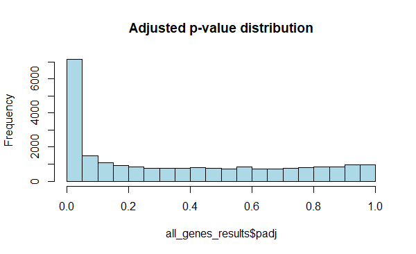
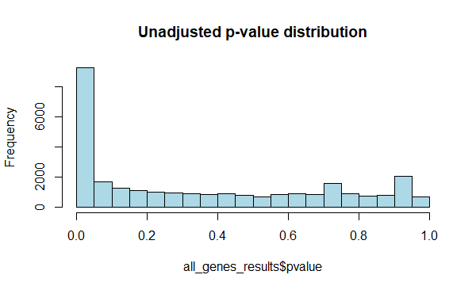
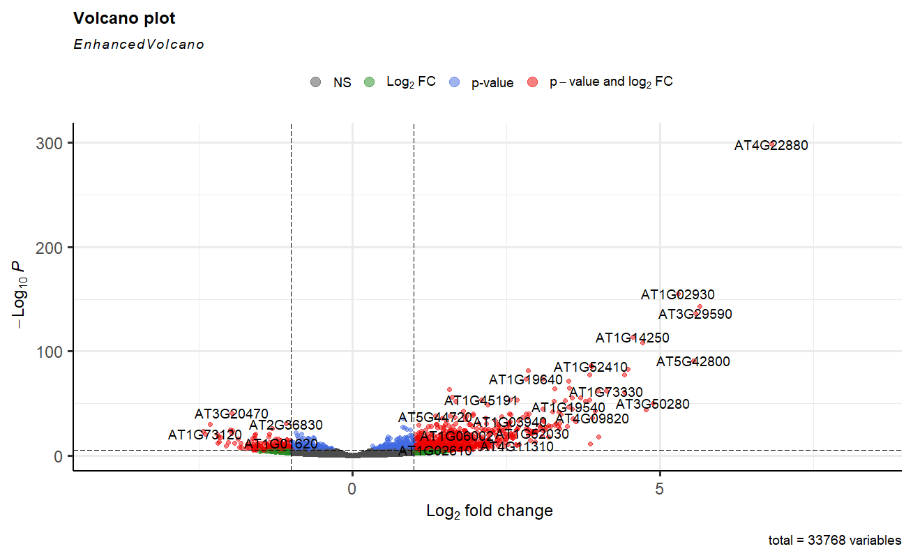

# Differential Expression and Gene Ontology Analysis of Arabidopsis RNA Samples

## Project Overview

In this project we focus on performing **Differential Expression Analysis** as well as **Gene Ontology** on Arabidopsis RNA samples which are either *mock* or *infected* with a certain bacteria.

Suppose we have a `.txt` file which includes the samples obtained from our experiment. Some samples are mock (our reference level); whereas the others are infected by a bacteria called *Pseudomonas syringae DC3000*. `dpi` shows the amount of days that have passed since the samples were obtained.

```
sample       seed   infected                       dpi
ERR1406259   MgCl2  mock                           2  
ERR1406271   MgCl2  mock                           2  
ERR1406282   MgCl2  Pseudomonas_syringae_DC3000    2  
ERR1406294   MgCl2  mock                           2  
```

Our main goal through **Differential Expression Analysis** is to see which genes are affected when the leaves are infected.

---

## Data Preparation

We start by reading the txt file and filtering out the samples based on the infected state and `dpi` of 7. In order to use **DESeq**, we need the samples to serve as rows.

We also have **raw counts** which show the different samples obtained for this experiment and the amount of gene expression in each. We don't need to check the gene expression in all the samples; only the ones that are also present in the first file so we filter the raw counts based on it.

---

## Normalization Methods

The next step is to normalize our counts. There are various normalization methods:

1. **RPKM**

   * Divide gene by sequencing depth
   * Divide gene by its length
2. **FPKM**

   * The same as RPKM but with paired-end sequencing
3. **TPM**

   * Divide gene by its length
   * Divide gene by sequencing depth

> Nowadays TPM is considered the most accurate among the three.
> Imagine we have 3 pies, all with the same size. If we say gene A has the size of 3.5 and gene B has the size of 3.4, we can tell A is bigger than B. But when it comes to RPKM, the pies are of different sizes. So it's hard to compare the proportion.

---

## Differential Expression Analysis with DESeq2

The main problem with the previously mentioned method is that the read count (sequencing depth) is different among different samples.

When we are comparing different samples to each other, we should expect different sequencing depths; let's say there are obviously more liver genes produced in liver than spleen genes.

Therefore, **DESeq2** has to take read depth and library composition into account.

```r
dds <- DESeqDataSetFromMatrix(countData = raw_counts_filtered, 
                              colData = xp_design_mock_vs_infected, 
                              design = ~ infected)
```

After creating the `dds` object, we can now perform a differential expression analysis between *mock* and *Pseudomonas\_syringae\_DC3000*.

```r
all_genes_results <- results(dds, contrast = c("infected", 
                                  "Pseudomonas_syringae_DC3000", 
                                  "mock"))
```

The results are calculated based on `log2`. For instance:

* `log2 = 1` → gene X has a higher expression in the infected condition.
* `log2 = -1` → gene X has a smaller expression (1/2) in the infected condition.

---

## False Discovery Rate (FDR) Filtering

We must consider the **False Discovery Rate**. This is due to performing thousands of statistical tests, leading to **false positives**.

```r
all_genes_results %>%
  as.data.frame() %>% 
  filter(padj < 0.01) %>% 
  dim()
```


---

## Volcano Plot Visualization

The next step is to visualize the data through a **volcano plot**. There are two factors considered:

* `log2` → change magnitude
* `p-value` → change significance

Example:
The gene **AT4G11911** has a massive 1024x increase in expression (log2 = 10.01 → 2^10 ≈ 1024) with extremely high significance (p = 5.2e-26).

Before plotting, we apply **log2 shrinkage** to reduce noise from low-count genes.

Interpretation of volcano plot:

* **Top-right/left**: Strongly up/downregulated, statistically significant.
* **Middle**: Changed but not significant.
* **Bottom**: No major change.

---

## Functional Enrichment Analysis (Gene Ontology)

Now that we have a list of differentially expressed genes, we want to understand what **biological pathways** were affected. This is called **Functional Enrichment Analysis** using **Gene Ontology (GO)**.

GO provides a tree-like structure of biological functions, organized into:

* **Biological Process (BP)**
* **Cellular Component (CC)**
* **Molecular Function (MF)**

Example resources:

* [KEGG](https://www.kegg.jp/)
* [AmiGO](http://amigo.geneontology.org/amigo/landing)
* [AriGO](http://systemsbiology.cau.edu.cn/agriGOv2/index.php)

---

## Selecting Genes for GO

We select the top 25% differentially expressed genes:

```r
diff_expressed_genes %>% 
  filter(log2FoldChange > quantile(log2FoldChange, c(0.75))) %>% 
  dplyr::select(gene) %>% 
  write.table(., file = "diff_genes_for_agrigo.tsv", row.names = FALSE, quote = FALSE)
```
## Overrepresentation Analysis (ORA) with Ensembl and Biomartr

We use Ensembl Plants and the `biomartr` library for annotation.
```r
biomartr::organismBM(organism = "Arabidopsis thaliana")
```
## Defining the Gene Universe

We need to define a **universe** of genes to compare our results against.

Example:

* Universe: 5% immune-related genes
* Your gene list: 30% immune-related genes
* p-value = 0.001 → strong enrichment

> Bottom Line
> **Universe** = "What’s normal?"
> **p-value** = "Is my result weird compared to normal?"

---

## Exploring Available Attributes

Before retrieving annotations, we check which attributes are available for *Arabidopsis thaliana*:

```r
arabido_attributes <- biomartr::organismAttributes("Arabidopsis thaliana") %>% 
  filter(dataset == "athaliana_eg_gene")

arabido_attributes
```

---

## Mapping IDs

We retrieve additional IDs such as TAIR, NCBI, and UniProt:

```r
attributes_to_retrieve = c("tair_symbol", "entrezgene_id", "uniprotswissprot")

# Annotating all genes
all_genes <- as.character(all_genes)
all_genes_annotated <- biomartr::biomart(
  genes      = all_genes,
  mart       = "plants_mart",
  dataset    = "athaliana_eg_gene",
  attributes = attributes_to_retrieve,
  filters    = "ensembl_gene_id"
)

# Annotating differentially expressed genes
diff_expressed_genes$gene <- as.character(diff_expressed_genes$gene)
diff_expressed_genes_annotated <- biomartr::biomart(
  genes      = diff_expressed_genes$gene,
  mart       = "plants_mart",
  dataset    = "athaliana_eg_gene",
  attributes = attributes_to_retrieve,
  filters    = "ensembl_gene_id"
)

head(all_genes_annotated)
head(diff_expressed_genes_annotated)
```

---

## Performing GO Enrichment in R

We run the enrichment using `clusterProfiler::enrichGO`.
The background universe is set to the annotated full gene set.

```r
ora_analysis_bp <- enrichGO(
  gene          = diff_expressed_genes_annotated$entrezgene_id,
  universe      = all_genes_annotated$entrezgene_id,
  OrgDb         = org.At.tair.db,   # TAIR/Ensembl id to GO correspondence for A. thaliana
  keyType       = "ENTREZID",
  ont           = "BP",             # BP = Biological Process, CC = Cellular Component, MF = Molecular Function
  pAdjustMethod = "BH",
  qvalueCutoff  = 0.05,
  readable      = TRUE,
  pool          = FALSE
)
```

---

## Simplifying and Exporting Results

```r
ora_analysis_bp_simplified <- clusterProfiler::simplify(ora_analysis_bp)

# Save results
write_delim(
  x    = as.data.frame(ora_analysis_bp_simplified@result), 
  path = "go_results.tsv", 
  delim = "\t"
)

# Inspect top hits
ora_analysis_bp_simplified@result[1:5, 1:8]
```

---

## Visualization

We can visualize enrichment results as plots:

```r
dotplot(ora_analysis_bp_simplified)

# Add pairwise semantic similarity and visualize as a network
ora_analysis_bp <- pairwise_termsim(ora_analysis_bp, method = "JC")
emapplot(ora_analysis_bp, color = "qvalue")
```

---

## Notes

* We can change `ont = "BP"` to `"CC"` or `"MF"` to analyze other ontology categories.
* The full pipeline includes:

  1. Attribute exploration
  2. Annotation of universe + gene list
  3. ORA with `enrichGO`
  4. Simplification
  5. Exporting results
  6. Visualization

---

## Conclusion

This pipeline provides a comprehensive view of how bacterial infection affects gene expression and biological function in *Arabidopsis thaliana*. From raw counts to biological insight, each step is crucial in narrowing down the candidate genes and pathways for further experimental validation.

---
